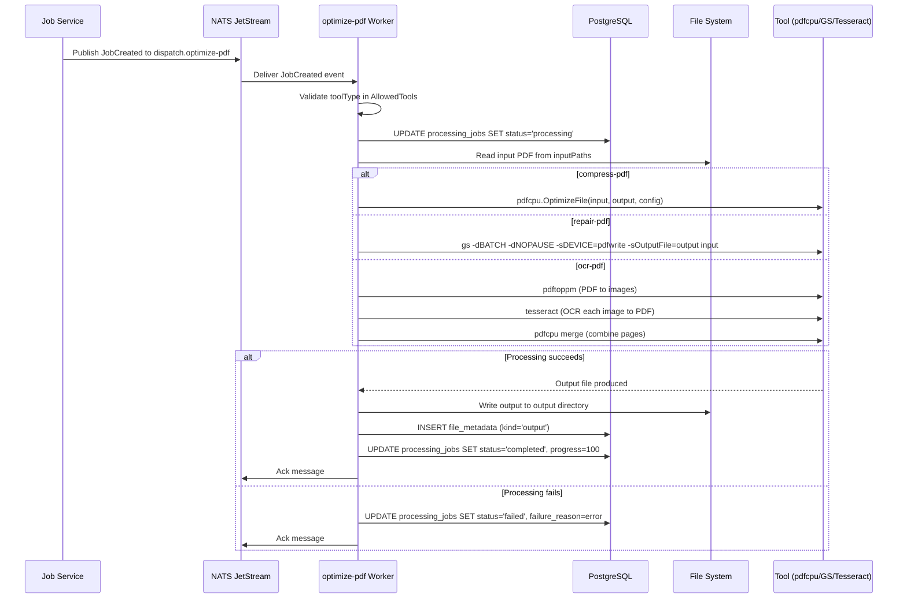
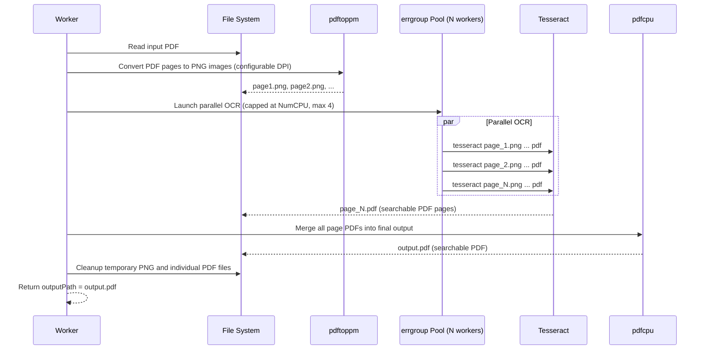
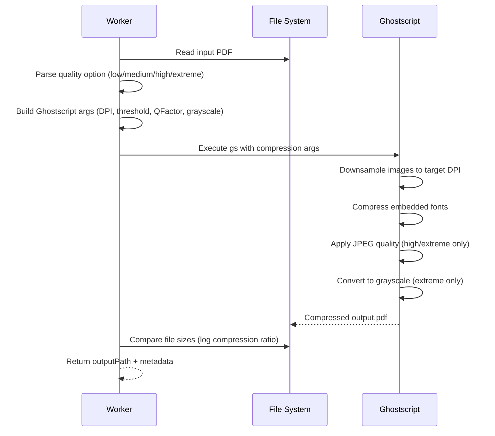
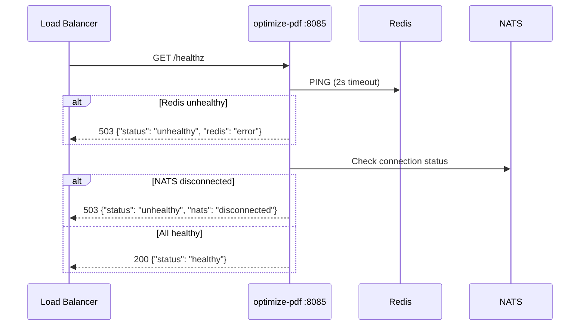

# Optimize PDF Service

PDF optimization microservice providing compression, repair, and OCR capabilities.

## Overview

| Property | Value |
|----------|-------|
| Port | 8085 |
| Route Prefix | `/api/optimize-pdf` |
| Queue | `queue:optimize-pdf` |

## Supported Operations

### 1. Compress PDF (`compress-pdf`)
Reduces PDF file size using Ghostscript optimization.

**Options:**
- `quality`: Compression level (frontend names → Ghostscript settings)
  - `low` - Light compression (`/printer`, 300dpi)
  - `medium` - Balanced compression (`/ebook`, 150dpi) [default]
  - `high` - Aggressive compression (`/ebook`, 72dpi, forced downsampling, JPEG quality reduction)
  - `extreme` - Maximum compression (`/screen`, 36dpi, forced downsampling, JPEG quality reduction, grayscale conversion)

**Example:**
```bash
curl -X POST http://localhost:8080/api/optimize-pdf/compress-pdf \
  -F "files=@large-document.pdf" \
  -F 'options={"quality":"ebook"}'
```

### 2. Repair PDF (`repair-pdf`)
Fixes corrupted or damaged PDFs using Ghostscript to rebuild the PDF structure.

**Example:**
```bash
curl -X POST http://localhost:8080/api/optimize-pdf/repair-pdf \
  -F "files=@corrupted-document.pdf"
```

### 3. OCR PDF (`ocr-pdf`)
Adds a searchable text layer to scanned PDFs using Tesseract OCR.

**Options:**
- `language`: OCR language code (default: `eng`)
- `dpi`: Resolution for conversion (default: `300`)

**Example:**
```bash
curl -X POST http://localhost:8080/api/optimize-pdf/ocr-pdf \
  -F "files=@scanned-document.pdf" \
  -F 'options={"language":"eng","dpi":"300"}'
```

## API Endpoints

| Method | Endpoint | Description |
|--------|----------|-------------|
| POST | `/:tool` | Create optimization job |
| GET | `/:tool` | List jobs by tool type |
| GET | `/:tool/:id` | Get job status |
| PATCH | `/:tool/:id` | Update job |
| DELETE | `/:tool/:id` | Delete job |
| GET | `/:tool/:id/download` | Download result |

## Job Status Flow

```
pending → processing → completed
                    ↘ failed
```

## Environment Variables

```env
# Database
DATABASE_URL="postgresql://user:password@db:5432/esydocs?sslmode=disable"

# Redis
REDIS_ADDR="redis:6379"
REDIS_PASSWORD=""
REDIS_DB="0"

# Processing
OUTPUT_DIR="outputs"
QUEUE_PREFIX="queue"
PROCESSING_TIMEOUT="30m"
MAX_RETRIES="3"
PORT="8085"

# JWT
JWT_HS256_SECRET="..."
JWT_ALLOWED_ALGS="HS256"
JWT_ISSUER="esydocs"
JWT_AUDIENCE="esydocs-api"

# Auth
AUTH_GUEST_PREFIX="guest"
AUTH_GUEST_SUFFIX="jobs"
AUTH_DENYLIST_ENABLED="true"

# OCR
OCR_DEFAULT_LANGUAGE="eng"
OCR_DEFAULT_DPI="300"
```

## Dependencies

### Go Packages
- `github.com/gin-gonic/gin` - HTTP framework
- `github.com/pdfcpu/pdfcpu` - PDF manipulation
- `gorm.io/gorm` - ORM
- `github.com/redis/go-redis/v9` - Redis client
- `golang.org/x/sync/errgroup` - Parallel OCR worker pool

### System Dependencies (Alpine)
- `poppler-utils` - PDF to image conversion (pdftoppm)
- `ghostscript` - PDF repair and rebuild
- `tesseract-ocr` - OCR engine
- `tesseract-ocr-data-eng` - English language data

## Architecture

```
┌─────────────────┐
│   API Gateway   │
│   (port 8080)   │
└────────┬────────┘
         │
         ▼
┌─────────────────┐
│  Optimize PDF   │
│   (port 8085)   │
├─────────────────┤
│ ┌─────────────┐ │
│ │  Handlers   │ │
│ └──────┬──────┘ │
│        │        │
│ ┌──────▼──────┐ │
│ │  Processing │ │
│ │  - Compress │ │
│ │  - Repair   │ │
│ │  - OCR      │ │
│ └──────┬──────┘ │
│        │        │
│ ┌──────▼──────┐ │
│ │   Worker    │ │
│ └─────────────┘ │
└────────┬────────┘
         │
    ┌────┴────┐
    ▼         ▼
┌───────┐ ┌───────┐
│ Redis │ │ Postgres│
└───────┘ └───────┘
```

## Docker

### Build
```bash
docker build -t optimize-pdf:latest .
```

### Test Dependencies
```bash
docker run --rm optimize-pdf:latest sh -c "
  gs --version && echo 'Ghostscript: OK'
  tesseract --version && echo 'Tesseract: OK'
  pdftoppm -v 2>&1 | head -1 && echo 'Poppler: OK'
"
```

## Development

### Local Setup
```bash
cd esydocs_backend/optimize-pdf
cp .env.example .env
go mod tidy
go run .
```

### Health Check
```bash
curl http://localhost:8085/healthz
```

## Sequence Diagrams

### Job Processing Flow (NATS Worker)



### OCR PDF Multi-Step Flow



### Compress PDF Flow



### Health Check Flow



### Readiness Probe

`/readyz` -- Readiness check (PostgreSQL + Redis + NATS), returns 200/503 with individual check results. Unlike `/healthz` (liveness), `/readyz` verifies all dependencies are connected.

## Error Flows

### Structured Error Codes

Failure reasons use structured error codes prefixed in brackets. The `classifyError()` function categorizes failures automatically.

| Code | Meaning |
|------|---------|
| `UNSUPPORTED_TOOL` | Tool type not handled by this service |
| `CONVERSION_FAILED` | Processing failed (default for unclassified errors) |
| `INVALID_PAYLOAD` | Malformed or unparseable job message |
| `OUTPUT_FAILED` | Failed to write or record output file |
| `TIMEOUT` | Processing exceeded deadline |

Example: `[TIMEOUT] context deadline exceeded`

### Processing Error Matrix

| Error Type | Tool(s) Affected | Handling | Retry |
|------------|-----------------|----------|-------|
| Invalid tool type | All | Reject, status=failed | No |
| Input file missing | All | status=failed | No |
| Corrupted PDF | compress, repair | Tool returns error, status=failed | No |
| Ghostscript failure | repair-pdf | status=failed with stderr | No |
| Tesseract not installed | ocr-pdf | status=failed | No |
| Invalid language code | ocr-pdf | Fallback to "eng" or status=failed | No |
| No text found by OCR | ocr-pdf | Returns PDF anyway (empty text layer) | No |
| Disk full | All | status=failed | No |
| Worker crash | All | NATS redelivery (MaxDeliver) | Yes |
| Database failure | All | Message not acked, NATS redelivery | Yes |

### NATS Redelivery

NATS JetStream handles retries via `AckWait` and `MaxDeliver`:
- Transient failures (worker crash, DB timeout) trigger redelivery
- Permanent failures (invalid input, missing tools) are acked to prevent infinite retry

When retries are exhausted (MaxDeliver reached), the failed job payload is published to `jobs.dlq.optimize-pdf` on the `JOBS_DLQ` stream (7-day retention) before the original message is acknowledged. This preserves failed jobs for debugging and replay.

## Processing Details

### Compress PDF
Uses Ghostscript with quality-differentiated settings:
- **low/medium**: Standard `-dPDFSETTINGS` with default downsample threshold (1.5x)
- **high**: Forced downsample threshold (1.0x) + JPEG quality reduction via `setdistillerparams` (QFactor 0.76)
- **extreme**: Forced downsample threshold (1.0x) + aggressive JPEG quality (QFactor 2.4) + grayscale conversion (`-dColorConversionStrategy=/Gray`)
- All levels: duplicate image detection, font compression, image downsampling

### Repair PDF
Uses Ghostscript to rebuild the PDF:
1. Reads the damaged PDF
2. Reconstructs the object structure
3. Rebuilds cross-reference tables
4. Outputs a valid PDF

### OCR PDF
Multi-step process:
1. Convert PDF pages to PNG images (pdftoppm)
2. Run Tesseract OCR on pages **in parallel** (errgroup worker pool, capped at `min(NumCPU, 4)`)
3. Generate searchable PDF pages
4. Merge all pages into final PDF (pdfcpu)
