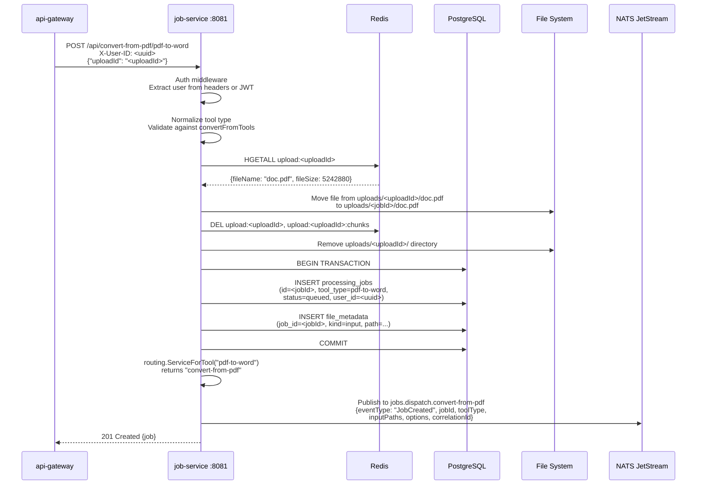
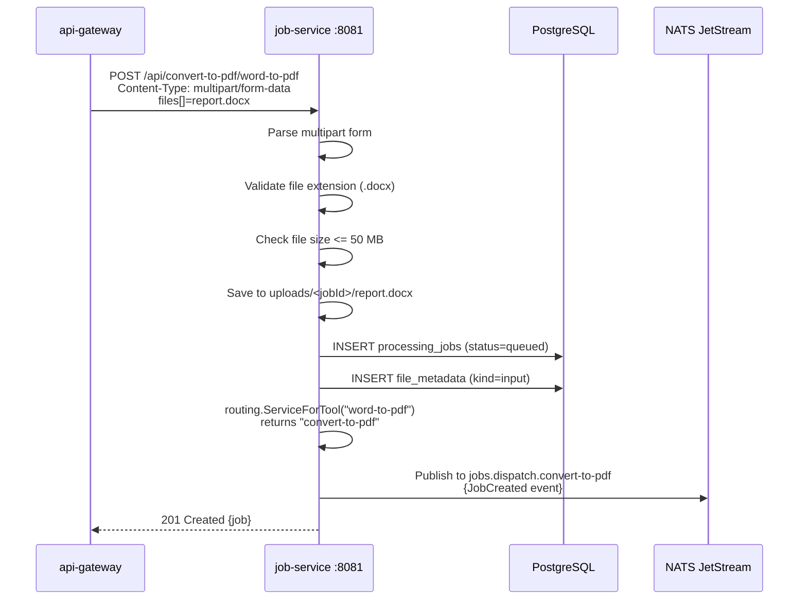
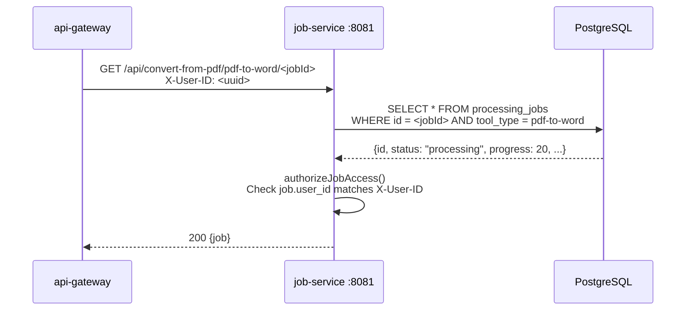
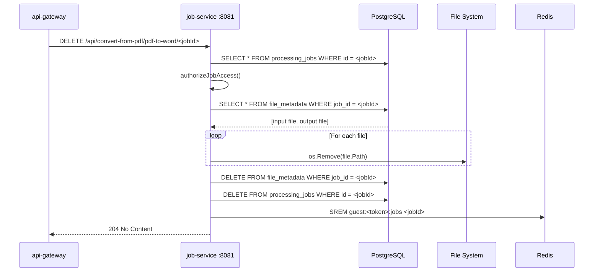
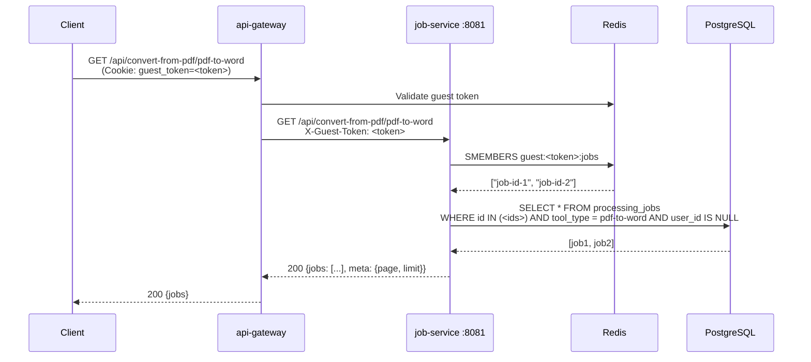
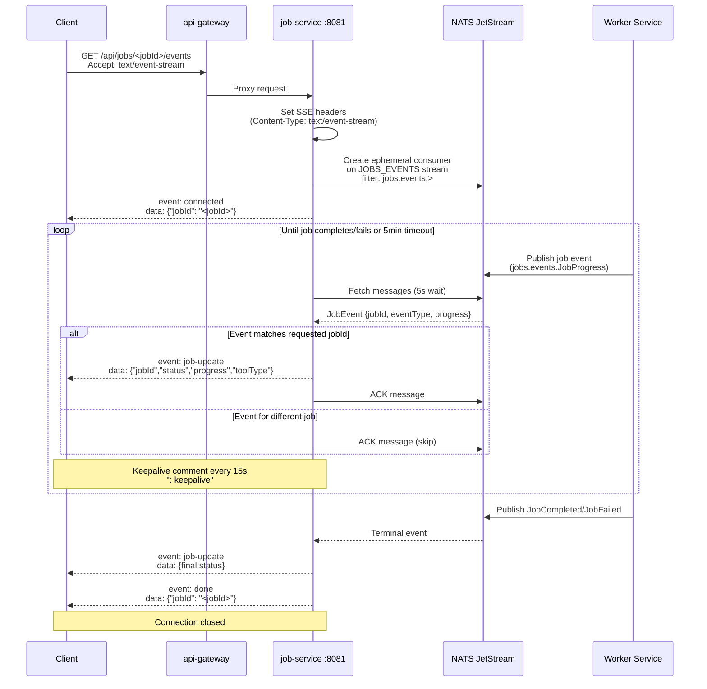

# Job Service -- Sequence Diagrams

Request flows through the `job-service`.

## Create Job (JSON body with uploadId)



## Create Job (Multipart upload)



## Get Job Status



## Download Completed Job

```mermaid
sequenceDiagram
    participant GW as api-gateway
    participant JS as job-service :8081
    participant PG as PostgreSQL
    participant Disk as File System

    GW->>JS: GET /api/convert-from-pdf/pdf-to-word/<jobId>/download<br/>X-User-ID: <uuid>

    JS->>PG: SELECT * FROM processing_jobs<br/>WHERE id = <jobId> AND tool_type = pdf-to-word
    PG-->>JS: {status: "completed"}

    JS->>JS: authorizeJobAccess() -- OK

    JS->>PG: SELECT * FROM file_metadata<br/>WHERE job_id = <jobId> AND kind = output
    PG-->>JS: {path: "outputs/result.docx", size: 2048000}

    JS->>JS: Determine filename: "doc.docx"<br/>Determine Content-Type

    JS->>Disk: Read outputs/result.docx

    JS-->>GW: 200 OK<br/>Content-Disposition: attachment; filename="doc.docx"<br/>Content-Type: application/vnd...wordprocessingml<br/>(file bytes)
```

## Delete Job



## Guest User Job Access



## SSE Job Status Updates


