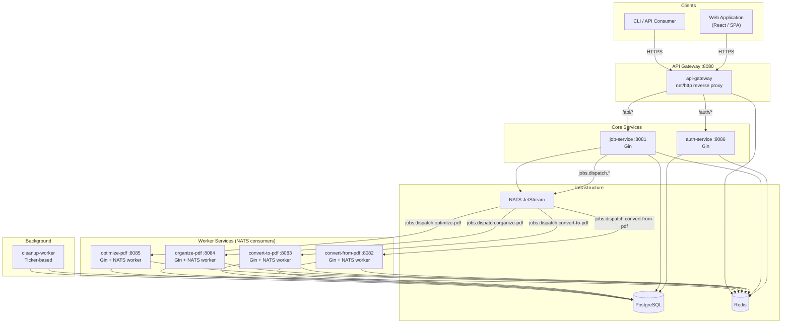
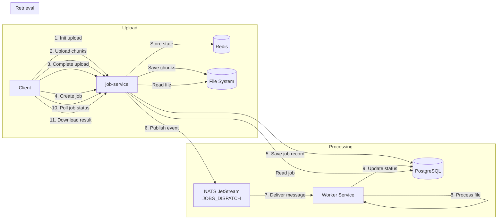
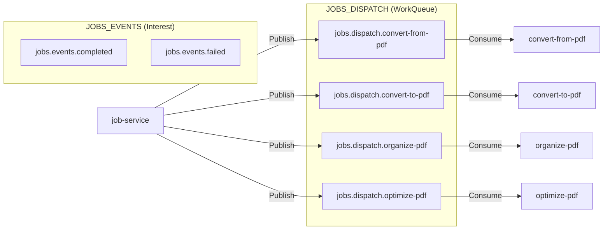
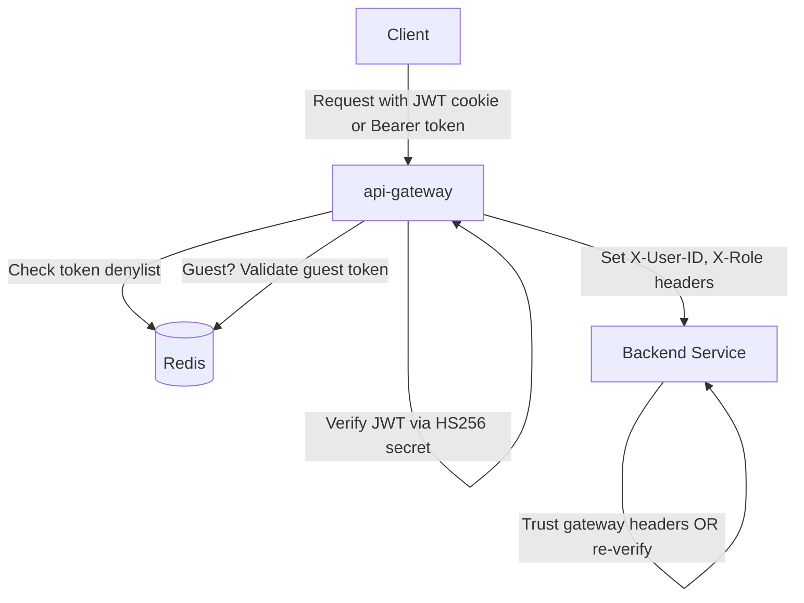

# System Overview

High-level architecture of the EsyDocs PDF processing platform.

## Service Topology

```mermaid
graph TB
    subgraph Clients
        WebApp["Web Application<br/>(React / SPA)"]
        CLI["CLI / API Consumer"]
    end

    subgraph Gateway["API Gateway :8080"]
        GW["api-gateway<br/>net/http reverse proxy"]
    end

    subgraph Core["Core Services"]
        AUTH["auth-service :8086<br/>Gin"]
        JOB["job-service :8081<br/>Gin"]
    end

    subgraph Workers["Worker Services (NATS consumers)"]
        CFP["convert-from-pdf :8082<br/>Gin + NATS worker"]
        CTP["convert-to-pdf :8083<br/>Gin + NATS worker"]
        ORG["organize-pdf :8084<br/>Gin + NATS worker"]
        OPT["optimize-pdf :8085<br/>Gin + NATS worker"]
    end

    subgraph Background
        CW["cleanup-worker<br/>Ticker-based"]
    end

    subgraph Infrastructure
        PG[(PostgreSQL)]
        RD[(Redis)]
        NATS["NATS JetStream"]
    end

    WebApp -->|HTTPS| GW
    CLI -->|HTTPS| GW

    GW -->|/auth/*| AUTH
    GW -->|/api/*| JOB

    JOB -->|jobs.dispatch.*| NATS
    NATS -->|jobs.dispatch.convert-from-pdf| CFP
    NATS -->|jobs.dispatch.convert-to-pdf| CTP
    NATS -->|jobs.dispatch.organize-pdf| ORG
    NATS -->|jobs.dispatch.optimize-pdf| OPT

    AUTH --> PG
    AUTH --> RD
    JOB --> PG
    JOB --> RD
    JOB --> NATS
    CFP --> PG
    CFP --> RD
    CTP --> PG
    CTP --> RD
    ORG --> PG
    ORG --> RD
    OPT --> PG
    OPT --> RD
    CW --> PG
    CW --> RD
    GW --> RD
```

## Data Flow Overview

```mermaid
flowchart LR
    subgraph Upload
        A[Client] -->|1. Init upload| B[job-service]
        A -->|2. Upload chunks| B
        A -->|3. Complete upload| B
        B -->|Store state| Redis[(Redis)]
        B -->|Save chunks| Disk[(File System)]
    end

    subgraph Processing
        A -->|4. Create job| B
        B -->|5. Save job record| PG[(PostgreSQL)]
        B -->|6. Publish event| NATS["NATS JetStream<br/>JOBS_DISPATCH"]
        NATS -->|7. Deliver message| W["Worker Service"]
        W -->|8. Process file| W
        W -->|9. Update status| PG
    end

    subgraph Retrieval
        A -->|10. Poll job status| B
        B -->|Read job| PG
        A -->|11. Download result| B
        B -->|Read file| Disk
    end
```

## NATS JetStream Streams

```mermaid
graph LR
    subgraph JOBS_DISPATCH["JOBS_DISPATCH (WorkQueue)"]
        D1["jobs.dispatch.convert-from-pdf"]
        D2["jobs.dispatch.convert-to-pdf"]
        D3["jobs.dispatch.organize-pdf"]
        D4["jobs.dispatch.optimize-pdf"]
    end

    subgraph JOBS_EVENTS["JOBS_EVENTS (Interest)"]
        E1["jobs.events.completed"]
        E2["jobs.events.failed"]
    end

    JS[job-service] -->|Publish| D1
    JS -->|Publish| D2
    JS -->|Publish| D3
    JS -->|Publish| D4

    D1 -->|Consume| CFP[convert-from-pdf]
    D2 -->|Consume| CTP[convert-to-pdf]
    D3 -->|Consume| ORG[organize-pdf]
    D4 -->|Consume| OPT[optimize-pdf]
```

## Authentication Flow

```mermaid
flowchart TD
    Client -->|Request with JWT cookie or Bearer token| GW[api-gateway]
    GW -->|Verify JWT via HS256 secret| GW
    GW -->|Check token denylist| Redis[(Redis)]
    GW -->|Guest? Validate guest token| Redis
    GW -->|Set X-User-ID, X-Role headers| Backend[Backend Service]
    Backend -->|Trust gateway headers OR re-verify| Backend
```
